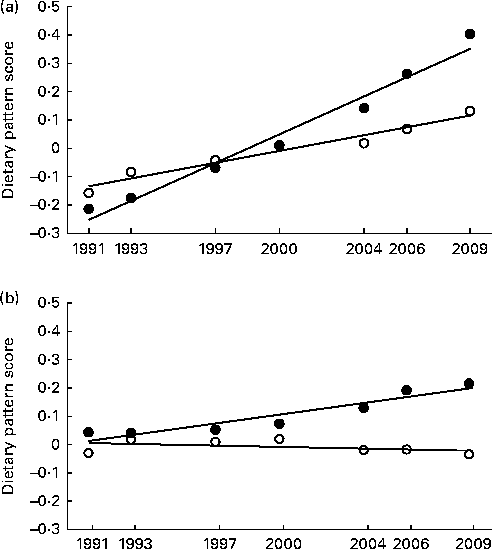
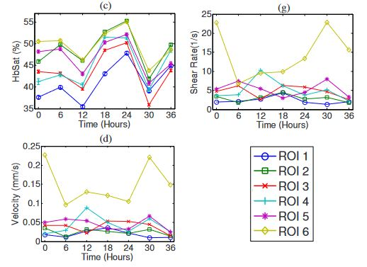

```{r setup, include=FALSE}
options(htmltools.dir.version = FALSE)
knitr::opts_chunk$set(
  fig.width=9, 
  fig.height=3.5, 
  fig.retina=3,
  #out.width = "50%",
  cache = FALSE,
  echo = TRUE,
  message = FALSE, 
  warning = FALSE,
  fig.show = TRUE,
  fig.showtext = TRUE,
  hiline = TRUE
)

# library(xaringanthemer)
# style_duo_accent(
#   primary_color = "#1381B0",
#   secondary_color = "#FF961C",
#   inverse_header_color = "#FFFFFF"
# )

xaringanExtra::use_panelset()
xaringanExtra::use_tile_view()
xaringanExtra::use_logo(
  image_url = "https://raw.githubusercontent.com/rstudio/hex-stickers/master/PNG/xaringan.png"
)
```


## Motivation

> Longitudinal studies (LS): Repeated measures on the subjects in multiple groups

--

> LS are a powerful tools because they allow to see the evolution of an effect over time

--

> Some examples of different areas of biomedical research that use longitudinal studies:

- Fertility

- Cancer

- Nutrition

---

### How do we analyze longitudinal data?

- The general rule in Biomedical Research: 

--

Repeated measures &#8594; repeated measures ANOVA (rm-ANOVA) &#8594; _post-hoc_ comparisons

--

### But what is exactly an rm-ANOVA?


\begin{equation}
y_{ijt} = \beta_0+\beta_1 \times time_{t} +\beta_2 \times treatment_{j} +\beta_3 \times time_{t}\times treatment_{j}+\varepsilon_{ijt}\\ 
\end{equation}

--
$y_{ijt}$: is the response for subject $i$ in treatment group $j$ at time $t$ </br> 
--
$\beta_0$: the mean group value </br>
--
$time_t$, $treatment_j$, $time_t \times treatment_j$: fixed effects of time and treatment and their interaction </br>
--
$\beta_1, \beta_2$ and $\beta_3$: linear slopes of the fixed effects. </br> 
--
$\varepsilon_{ijt}$: Errors that represent random variation not explained by the fixed effects, assumed to be $\sim N(0,\sigma^2)$</br>
--
(independently and identically normally distributed with mean zero and variance $\sigma^2$).

---

### In other words...


An rm-ANOVA is a model that fits a **line** to the trend of the data!
 
.pull-left[

]
.footnote[
_Batis et. al. 2013_
]

.pull-right[
 - It works reasonably well in cases like this!
 ]
 
 --
.pull-right[
 - But in biomedical research things don't look linear!
]
---

## Some examples



---
name: colors

## Colors

- <span style="color: var(--text-color)">Text Color</span>

- <span style="color: var(--header-color); font-family: var(--header-font-family);">Header Color</span>

- <span style="color: var(--link-color)">Link Color</span>

- <span style="color: var(--text-bold-color); font-weight: bold;">Bold Color</span>

- `inline code color`

---

# Big Topic or Inverse Slides `#`

## Slide Headings `##`

### Sub-slide Headings `###`

#### Bold Call-Out `####`

This is a normal paragraph text. Only use header levels 1-4.

##### Possible, but not recommended `#####`

###### Definitely don't use h6 `######`

---
class: inverse center middle

# Topic Changing Interstitial

--

```
class: inverse center middle
```

---
layout: true

## Blocks

---

### Blockquote

> This is a blockquote following a header.
>
> When something is important enough, you do it even if the odds are not in your favor.

---

### Code Blocks

#### R Code

```{r eval=FALSE}
ggplot(gapminder) +
  aes(x = gdpPercap, y = lifeExp, size = pop, color = country) +
  geom_point() +
  facet_wrap(~year)
```

#### JavaScript

```js
var fun = function lang(l) {
  dateformat.i18n = require('./lang/' + l)
  return true;
}
```

---

### More R Code

```{r eval=FALSE}
dplyr::starwars %>% dplyr::slice_sample(n = 4)
```

---

```{r message=TRUE}
cli::cli_alert_success("It worked!")
```

--

```{r message=TRUE}
message("Just a friendly message")
```

--

```{r warning=TRUE}
warning("This could be bad...")
```

--

```{r error=TRUE}
stop("I hope you're sitting down for this")
```


---
layout: true

## Tables

---

```{r}
tibble::as_tibble(mtcars)
```

---

```{r}
knitr::kable(head(mtcars), format = 'html')
```

---

```{r}
DT::datatable(head(mtcars), fillContainer = FALSE, options = list(pageLength = 4))
```

---
layout: true

## Lists

---

.pull-left[
#### Here is an unordered list:

*   Item foo
*   Item bar
*   Item baz
*   Item zip
]

.pull-right[

#### And an ordered list:

1.  Item one
1.  Item two
1.  Item three
1.  Item four
]

---

### And a nested list:

- level 1 item
  - level 2 item
  - level 2 item
    - level 3 item
    - level 3 item
- level 1 item
  - level 2 item
  - level 2 item
  - level 2 item
- level 1 item
  - level 2 item
  - level 2 item
- level 1 item

---

### Nesting an ol in ul in an ol

- level 1 item (ul)
  1. level 2 item (ol)
  1. level 2 item (ol)
    - level 3 item (ul)
    - level 3 item (ul)
- level 1 item (ul)
  1. level 2 item (ol)
  1. level 2 item (ol)
    - level 3 item (ul)
    - level 3 item (ul)
  1. level 4 item (ol)
  1. level 4 item (ol)
    - level 3 item (ul)
    - level 3 item (ul)
- level 1 item (ul)

---
layout: true

## Plots

---

```{r plot-example}
library(ggplot2)
(g <- ggplot(mpg) + aes(hwy, cty, color = class) + geom_point())
```

---

```{r plot-example-themed}
g + xaringanthemer::theme_xaringan(text_font_size = 16, title_font_size = 18) +
  ggtitle("A Plot About Cars")
```

---
layout: false

## Square image

<center></center>

.footnote[GitHub Octocat]

---

### Wide image


.footnote[Wide images scale to 100% slide width]

---

## Two images

.pull-left[

]

.pull-right[

]

---

### Definition lists can be used with HTML syntax.

<dl>
<dt>Name</dt>
<dd>Godzilla</dd>
<dt>Born</dt>
<dd>1952</dd>
<dt>Birthplace</dt>
<dd>Japan</dd>
<dt>Color</dt>
<dd>Green</dd>
</dl>

---
class: center, middle

# Thanks!

Slides created via the R packages:

[**xaringan**](https://github.com/yihui/xaringan)<br>
[gadenbuie/xaringanthemer](https://github.com/gadenbuie/xaringanthemer)

The chakra comes from [remark.js](https://remarkjs.com), [**knitr**](http://yihui.name/knitr), and [R Markdown](https://rmarkdown.rstudio.com).
