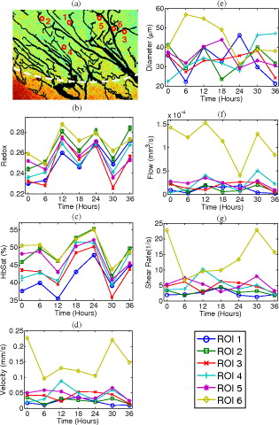

```{r meta, echo=FALSE, warning=FALSE}
library(metathis)
meta() %>%
  meta_general(
    description = "Generalized additive models for biomedical research",
    generator = "xaringan and remark.js"
  ) %>% 
  meta_name("github-repo" = "aimundo/RMedicine2021") %>% 
  meta_social(
    title = "Generalized additive models for longitudinal biomedical data",
    #url = "https://spcanelon.github.io/xaringan-basics-and-beyond/slides/day-01-basics.html#1",
    #image = "https://raw.githubusercontent.com/spcanelon/xaringan-basics-and-beyond/main/slides/day-01-cover-image.png",
    og_type = "website",
    og_author = "Ariel Mundo",
    twitter_card_type = "summary_large_image",
    twitter_creator = "@amundortiz"
  )
```

```{r setup, include=FALSE}
options(htmltools.dir.version = FALSE)
library(icons)
library(xaringanExtra)
library(tidyverse)
library(mgcv)
library(ggplot2)
library(patchwork)
library(here)
library(emmeans)
library(gganimate)
set.seed(1) #for reproducibility
knitr::opts_chunk$set(
  fig.width=9, 
  fig.height=3.5, 
  fig.retina=3,
  #out.width = "50%",
  cache = FALSE,
  echo = TRUE,
  message = FALSE, 
  warning = FALSE,
  fig.show = TRUE,
  fig.showtext = TRUE,
  hiline = TRUE
)

xaringanExtra::use_panelset()
xaringanExtra::use_tile_view()
xaringanExtra::use_share_again()
xaringanExtra::style_share_again(
  share_buttons = c("twitter","linkedin")
)
xaringanExtra::use_logo(
  image_url = "https://raw.githubusercontent.com/rstudio/hex-stickers/master/PNG/xaringan.png"
)

```

class: title-slide, right, top
background-image: url(img/r_medicine.jpg)
background-position: 10% 75%, 75% 75%
background-size: 30%, cover

.right-column[
# `r rmarkdown::metadata$title`
### `r rmarkdown::metadata$subtitle`

**`r rmarkdown::metadata$author`**<br>
<br>
`r rmarkdown::metadata$institute` <br><br>
`r rmarkdown::metadata$date`
]


???

Welcome to the workshop on sharing your work with xaringan.

Where I'll show you how to create impressive presentation slides that can be deployed to the web for easy sharing.

---
name: about-me
layout: false
class: about-me-slide, inverse, middle, center

# About me


## Ariel Mundo

### PhD Candidate

.fade[Department of Biomedical Engineering<br>University of Arkansas<br> Fayetteville, AR, USA]

[`r icons::fontawesome("link")` aimundo.rbind.io](https://aimundo.rbind.io)
[`r icons::fontawesome("twitter")` @amundortiz](https://twitter.com/amundortiz)
[`r icons::icon_style(icons::fontawesome("github"), scale = 1)` @aimundo](https://github.com/aimundo)

---
class: center
The material of this flash talk is covered in depth in a paper from our lab (under review) the preprint is available at

.center[

]

.center[

]

doi: https://doi.org/10.1101/2021.06.10.447970 <br/>

The slides of this talk are available at

---

# Motivation

> Longitudinal studies (LS): Repeated measures on the subjects in multiple groups

--

> LS are a powerful tools because they allow to see the evolution of an effect over time

--

> Some examples of different areas of biomedical research that use longitudinal studies:

- Fertility

- Cancer

- Nutrition

---

### How do we analyze longitudinal data?

- The general rule in Biomedical Research: 

--

Repeated measures &#8594; repeated measures ANOVA (rm-ANOVA) &#8594; _post-hoc_ comparisons

--

### But what is exactly an rm-ANOVA?


\begin{equation}
y_{ijt} = \beta_0+\beta_1 \times time_{t} +\beta_2 \times treatment_{j} +\beta_3 \times time_{t}\times treatment_{j}+\varepsilon_{ijt}\\ 
\end{equation}

--
$y_{ijt}$: is the response for subject $i$ in treatment group $j$ at time $t$ </br> 

--
$\beta_0$: the mean group value </br>

--
$time_t$, $treatment_j$, $time_t \times treatment_j$: fixed effects of time and treatment and their interaction </br>

--
$\beta_1, \beta_2$ and $\beta_3$: linear slopes of the fixed effects. </br> 
 
--
$\varepsilon_{ijt}$: random variation not explained by the fixed effects, assumed to be $\sim N(0,\sigma^2)$</br>

--
(independently and identically normally distributed with mean zero and variance $\sigma^2$).

---

### In other words...


An rm-ANOVA is a model that fits a **line** to the trend of the data!
 
.pull-left[

]
.footnote[
_Batis et. al. 2013_
]

.pull-right[

 - It works reasonably well in certain cases
 ## But in biomedical research things don't look linear!
 ]
 

---

## Some examples
.pull-left[

]
.footnote[
_Skala et. al. 2010_
]

--

.pull-right[

.footnote[
_Vishwanath et. al. 2009_
]
]

---
## A visual example

Some simulated data that follows trends of tumor volume reported in Zheng et. al. (2019). Simulation is useful here because we can only get a mean value from the paper. 

.pull-left[
```{r,data-plot,echo=FALSE,fig.width=7,fig.height=5}
data<-read.csv(here("data","tumor_data.csv")) #read data, mean tumor volume trend
data$Group<-as.factor(data$Group) #make Group a factor

#plot data
ggplot(data,aes(x=Day,y=Volume,group=Group,color=Group))+
    geom_line(size=2)+
    theme_classic()+
  theme(
        axis.text=element_text(size=22)
    )+
    scale_colour_viridis_d(option="turbo",end=1)


```
]


.pull-right[
```{r, simulated-data,echo=FALSE,fig.height=5,fig.width=7}
simulate_data <- function(dat, n = 10, sd = 15) {
    dat_sim <- dat %>%
        slice(rep(1:n(), each = n)) %>%
        group_by(Group, Day) %>%
        mutate(
            Vol_sim = pmax(rnorm(n, Volume, sd), 0.0001),
            subject=rep(1:10),
            subject=factor(paste(subject, Group, sep = "-"))
        ) %>%
        ungroup()

    return(dat_sim)
}

n <- 10 #number of observations (from paper)
sd <- 40 #mm3 approximate sd from paper
dat_sim <- simulate_data(data, n, sd)
breaks_s<-c(0,2,4,6,8,10,12,14) #set tick marks

#plotting simulated data
ggplot(dat_sim, aes(x = Day, y = Vol_sim, color = Group)) +
    geom_point(show.legend=FALSE,size=1.5,alpha=0.5)+
    stat_summary(aes(y = Vol_sim,
                     group=Group),
                 fun=mean, geom="line",size=1,show.legend = FALSE)+
    labs(y=expression(atop(Volume (mm^3),'(simulated)')))+
    theme_classic()+
    theme(
        axis.text=element_text(size=22)
    )+
    scale_x_continuous(breaks=breaks_s)+
    scale_colour_viridis_d(option="turbo",end=1)


```
]

---
--- 

### How does an rm-ANOVA model look on this data?

- Linear model with interaction of time and group:

.panelset[
.panel[.panel-name[model]

```{r,rm-ANOVA, eval=TRUE, echo=TRUE}
lm1<-lm(Vol_sim ~ Day + Group + Day * Group, data = dat_sim)

```
]

.panel[.panel-name[Plot]

```{r,rm-ANOVA plot, echo=FALSE, fig.width=7,fig.height=5,fig.align='center'}
lm_predict<-expand_grid(Group = factor(c("T1", "T2")),
                        Day = c(0:15),
                        subject=factor(rep(1:10)),
)
lm_predict$subject<-factor(paste(lm_predict$subject, lm_predict$Group, sep = "-"))

#using lm
lm_predict<-lm_predict%>%
    mutate(fit = predict(lm1,lm_predict,se.fit = TRUE,type='response')$fit,
           se.fit = predict(lm1, lm_predict,se.fit = TRUE,type='response')$se.fit)

#plot linear fit for rm-ANOVA
f4<-ggplot(data=dat_sim, aes(x=Day, y=Vol_sim, group=Group)) +
    geom_point(aes(color=Group),size=1.5,alpha=0.5,show.legend = FALSE)+
    geom_ribbon(aes( x=Day,ymin=(fit - 2*se.fit),
                     ymax=(fit + 2*se.fit),fill=Group),
                alpha=0.3,
                data=lm_predict,
                show.legend = FALSE,
                inherit.aes=FALSE) +
    geom_line(aes(y=fit,
                  color=Group),
              size=1,data=lm_predict,
              show.legend = FALSE)+
    #facet_wrap(~Group)+
    labs(y=expression(paste('Volume'(mm^3))))+
    scale_x_continuous(breaks=breaks_s)+
    theme_classic()+
    theme(
        axis.text=element_text(size=22)
    )+
    scale_colour_viridis_d(option="turbo",end=1)

f4
```
]

.panel[.panel-name[p-values]

```{r,p-values,echo=TRUE}
anova(lm1)
```

]

.panel[.panel-name[post-hoc]

```{r,post-hoc,echo=TRUE}
emmeans(lm1, ~Day * Group, adjust = "bonf")

```

]
]

---
## An alternative: Generalized additive models (GAMs)

\begin{equation}
  y_{ijt}=\beta_0+f(x_t\mid \beta_j)+\varepsilon_{ijt}
\end{equation}

$y_{ijt}$: response at time $t$ of subject  $i$ in group $j$ 

$\beta_0$: expected value at time 0 

The change of $y_{ijt}$ over time is represented by the _smooth function_ $f(x_t\mid \beta_j)$ with inputs as the covariates $x_t$ and parameters $\beta_j$ 

$\varepsilon_{ijt}$ represents the residual error

---
## An alternative: GAMs

```{r,basis-functions-plot, echo=FALSE,fig.height=7,fig.width=12, fig.align='center'}
n_time = 6
 x <- seq(1,6, length.out = n_time)
 mu <- matrix(0, length(x), 2)
 mu[, 1] <-  -(0.25 * x^2) +1.5*x-1.25 #mean response
 mu[, 2] <- (0.25 * x^2) -1.5*x+1.25 #mean response
 y <- array(0, dim = c(length(x), 2, 10))
 errors <- array(0, dim = c(length(x), 2, 10))
 for (i in 1:2) {     # number of treatments
     for (j in 1:10) {  # number of subjects
         # compound symmetry errors
         errors[, i, j] <- rmvn(1, rep(0, length(x)), 0.1 * diag(6) + 0.25 * matrix(1, 6, 6))
         y[, i, j] <- mu[, i] + errors[, i, j]
     }
 }
 
 #label each table
  dimnames(y) <- list(time = x, treatment = 1:2, subject = 1:10)
 dimnames(errors) <- list(time = x, treatment = 1:2, subject = 1:10)
 dimnames(mu) <- list(time = x, treatment = 1:2)
 
 #Convert to dataframes with subject, time and group columns
 dat <- as.data.frame.table(y, responseName = "y")
 dat_errors <- as.data.frame.table(errors, responseName = "errors")
 dat_mu <- as.data.frame.table(mu, responseName = "mu")
 dat <- left_join(dat, dat_errors, by = c("time", "treatment", "subject"))
 dat <- left_join(dat, dat_mu, by = c("time", "treatment"))
 dat$time <- as.numeric(as.character(dat$time))
 
 #label subject per group
 dat <- dat %>%
     mutate(subject = factor(paste(subject, treatment, sep = "-")))
  
 #extract  "Group 1" to fit the GAM
  dat<-subset(dat,treatment==1)
 #keep just the response and timepoint columns
   dat<-dat[,c('y','time')]

   #GAM model of time, 5 knots
gm<-gam(y~s(time,k=5),data=dat)

#model_matrix (also known as) 'design matrix'
#will contain the smooths used to create  model 'gm'
model_matrix<-as.data.frame(predict(gm,type='lpmatrix'))


time<-c(1:6)

basis<-model_matrix[1:6,] #extracting basis (because the values are repeated after every 6 rows)
#basis<-model_matrix[1:6,-1] #extracting basis
colnames(basis)[colnames(basis)=="(Intercept)"]<-"s(time).0"
basis<-basis %>% #pivoting to long format
  pivot_longer(
    cols=starts_with("s")
  )%>%
  arrange(name) #ordering

#length of dataframe to be created: number of knots by number of timepoints (minus 1 for the intercept that we won't plot)
ln<-6*(length(coef(gm))) 

basis_plot<-data.frame(Basis=integer(ln),
                       value_orig=double(ln),
                       time=integer(ln),
                       cof=double(ln)
)

basis_plot$time<-rep(time) #pasting timepoints
basis_plot$Basis<-factor(rep(c(1:5),each=6)) #pasting basis number values
basis_plot$value_orig<-basis$value #pasting basis values
basis_plot$cof<-rep(coef(gm)[1:5],each=6) #pasting coefficients
basis_plot<-basis_plot%>%
  mutate(mod_val=value_orig*cof) #the create the predicted values the bases need to be 
#multiplied by the coefficients

#creating labeller to change the labels in the basis plots

basis_names<-c(
  `1`="Intercept",
  `2`="1",
  `3`="2",
  `4`="3",
  `5`="4"
)

#calculating the final smooth by aggregating the basis functions

smooth<-basis_plot%>% 
  group_by(time)%>%
  summarize(smooth=sum(mod_val))


#original basis
sz<-1
p11<-ggplot(basis_plot,
            aes(x=time,
                y=value_orig,
                colour=as.factor(Basis)
                )
            )+
  geom_line(size=sz,
            show.legend=FALSE)+
  geom_point(size=sz+1,
             show.legend = FALSE)+
  labs(y='Basis functions')+
  facet_wrap(~Basis,
             labeller = as_labeller(basis_names)
             )+
  theme_classic()
  

#penalized basis
p12<-ggplot(basis_plot,
            aes(x=time,
                y=mod_val,
                colour=as.factor(Basis)
                )
            )+
  geom_line(show.legend = FALSE,
            size=sz)+
  geom_point(show.legend = FALSE,
             size=sz+1)+
  labs(y='Penalized \n basis functions')+
  scale_y_continuous(breaks=seq(-1,1,1))+
  facet_wrap(~Basis,
             labeller=as_labeller(basis_names)
             )+
  theme_classic()

#heatmap of the  coefficients
x_labels<-c("Intercept","1","2","3","4")
p13<-ggplot(basis_plot,
            aes(x=Basis,
                y=Basis))+
  geom_tile(aes(fill = cof), 
            colour = "black") +
    scale_fill_gradient(low = "white",
                        high = "#B50A2AFF")+ 
  labs(x='Basis',
       y='Basis')+
  scale_x_discrete(labels=x_labels)+
  geom_text(aes(label=round(cof,2)),
            size=7,
            show.legend = FALSE)+
  theme_classic()+
  theme(legend.title = element_blank())
  
#plotting simulated datapoints and smooth term
p14<-ggplot(data=dat,
            aes(x=time,y=y))+
  geom_point(size=sz+1)+
  labs(y='Simulated \n response')+
  geom_line(data=smooth,
            aes(x=time,
                y=smooth),
            color="#6C581DFF",
            size=sz+1)+
  theme_classic()
  

#Combining all
b_plot<-p11+p13+p12+p14+plot_annotation(tag_levels='A')&
  theme(
     text=element_text(size=18)
     )

b_plot
```

---

## How does a GAM model look for the simulated data?
.panelset[
.panel[.panel-name[model]

```{r,GAM}
gam1 <- gam(Vol_sim ~ Group+s(Day, by = Group, k = 10),
          method='REML',
          data  = dat_sim)

```
]

.panel[.panel-name[Plot]

```{r,GAM-plot,echo=FALSE,fig.width=7,fig.height=5,fig.align='center'}
#creates a dataframe using the length of the covariates for the GAM
gam_predict <- expand_grid(Group = factor(c("T1", "T2")),
                           Day = seq(0, 15, by = 0.1),
                           subject=factor(rep(1:10)))

#adds the predictions to the grid and creates a confidence interval for GAM
gam_predict<-gam_predict%>%
    mutate(fit = predict(gam1,gam_predict,se.fit = TRUE,type='response')$fit,
           se.fit = predict(gam1, gam_predict,se.fit = TRUE,type='response')$se.fit)

#plot smooths and confidence interval for GAM
f3<-ggplot(data=dat_sim, aes(x=Day, y=Vol_sim, group=Group)) +
    geom_point(aes(color=Group),size=1.5,alpha=0.5,show.legend = FALSE)+
    geom_ribbon(aes( x=Day,ymin=(fit - 2*se.fit),
                     ymax=(fit + 2*se.fit),
                     fill=Group
    ),
    alpha=0.3,
    data=gam_predict,
    show.legend=FALSE,
    inherit.aes=FALSE) +
    geom_line(aes(y=fit,
                  color=Group),
              size=1,data=gam_predict,
              show.legend = FALSE)+
    #facet_wrap(~Group)+
    labs(y=expression(atop("Tumor volume", (mm^3))))+
    scale_x_continuous(breaks=breaks_s)+
    theme_classic()+
    theme(
        axis.text=element_text(size=22)
    )+
    scale_colour_viridis_d(option="turbo",end=1)

f3
```

]

.panel[.panel-name[Pairwise comp.]

```{r,GAM-tumor-plot,echo=FALSE,fig.align='center',fig.width=8,fig.height=6}
##Pairwise comparisons

pdat <- expand.grid(Day = seq(0, 15, length = 400),
                    Group = c('T1', 'T2'))

#this function takes the model, grid and groups to be compared using the lpmatrix

smooth_diff <- function(model, newdata, g1, g2, alpha = 0.05,
                        unconditional = FALSE) {
    xp <- predict(model, newdata = newdata, type = 'lpmatrix')
    #Find columns in xp where the name contains "Control" and "Treatment"
    col1 <- grepl(g1, colnames(xp))
    col2 <- grepl(g2, colnames(xp))
    #Find rows in xp that correspond to each treatment
    row1 <- with(newdata, Group == g1)
    row2 <- with(newdata, Group == g2)
    ## difference rows of xp for data from comparison
    X <- xp[row1, ] - xp[row2, ]
    ## zero out cols of X related to splines for other lochs
    X[, ! (col1 | col2)] <- 0
    ## zero out the parametric cols
    #X[, !grepl('^s\\(', colnames(xp))] <- 0
    dif <- X %*% coef(model)
    se <- sqrt(rowSums((X %*% vcov(model, unconditional = unconditional)) * X))
    crit <- qt(alpha/2, df.residual(model), lower.tail = FALSE)
    upr <- dif + (crit * se)
    lwr <- dif - (crit * se)
    data.frame(pair = paste(g1, g2, sep = '-'),
               diff = dif,
               se = se,
               upper = upr,
               lower = lwr)
}

comp1<-smooth_diff(gam1,pdat,'T1','T2')

comp_Vol_sim <- cbind(Day = seq(0, 15, length = 400),
                        rbind(comp1)) %>%
    mutate(interval=case_when(
        upper>0 & lower<0~"no-diff",
        upper<0~"less",
        lower>0~"greater"
    ))

#function to obtain values for the shading regions
pairwise_limits<-function(dataframe){
    #extract values where the lower limit of the ribbon is greater than zero
    #this is the region where the control group effect is greater
    v1<-dataframe%>%
        filter(lower>0)%>%
        select(Day)
    #get day  initial value
    init1=v1$Day[[1]]
    #get day final value
    final1=v1$Day[[nrow(v1)]]

    my_list<-list(
                  init1=init1,
                  final1=final1)
    return(my_list)
}

my_list<-pairwise_limits(comp_Vol_sim)
rib_col<-'#EDD03AFF' #color for ribbon

c1<-ggplot(comp_Vol_sim, aes(x = Day, y = diff, group = pair)) +
    annotate("rect",
             xmin =my_list$init1, xmax =my_list$final1,ymin=-Inf,ymax=Inf,
             fill='#30123BFF',
             alpha = 0.5,
    ) +
    annotate("text",
             x=7,
             y=300,
             label="T1>T2",
             size=8,
             angle=0
    )+
    geom_ribbon(aes(ymin = lower, ymax = upper),
                alpha = 0.5,
                fill=rib_col) +
    geom_line(data=comp_Vol_sim,aes(y=0),size=0.5)+
    geom_line(color='black',size=1) +
    facet_wrap(~ pair) +
    theme_classic()+
    labs(x = 'Days', y = expression(paste('Difference in tumor volume' )))+
    scale_x_continuous(breaks=breaks_s)+
    theme(
        text=element_text(size=18),
        legend.title=element_blank()
    )
c1

```

]
]
---
class: center

# Acknowledgements

.pull-left[
Dr. John R. Tipton <br> <br>
Department of Mathematical Sciences, University of Arkansas

Dr. Timothy J. Muldoon <br> <br> 
Department of Biomedical Engineering, University of Arkansas
]

.pull-right[
 <br> <br>

]

---

## References

- Batis, C., Sotres-Alvarez, D., Gordon-Larsen, P., Mendez, M., Adair, L., & Popkin, B. (2014). Longitudinal analysis of dietary patterns in Chinese adults from 1991 to 2009. _British Journal of Nutrition_, 111(8), 1441-1451. doi:10.1017/S0007114513003917

- Skala, M. C., Fontanella, A. N., Lan, L., Izatt, J. A., & Dewhirst, M. W. (2010). Longitudinal optical imaging of tumor metabolism and hemodynamics. _Journal of biomedical optics, 15(1)_, 011112.doi: 10.1117/1.3285584

- Vishwanath, K., Yuan, H., Barry, W. T., Dewhirst, M. W., & Ramanujam, N. (2009). Using optical spectroscopy to longitudinally monitor physiological changes within solid tumors. _Neoplasia_ (New York, N.Y.), 11(9), 889–900. doi: 10.1593/neo.09580

- Zheng, X., Cui, L., Chen, M., Soto, L. A., Graves, E. E., & Rao, J. (2019). A near-infrared phosphorescent nanoprobe enables quantitative, longitudinal imaging of tumor hypoxia dynamics during radiotherapy. Cancer research, 79(18), 4787-4797. doi: 10.1158/0008-5472.CAN-19-0530
